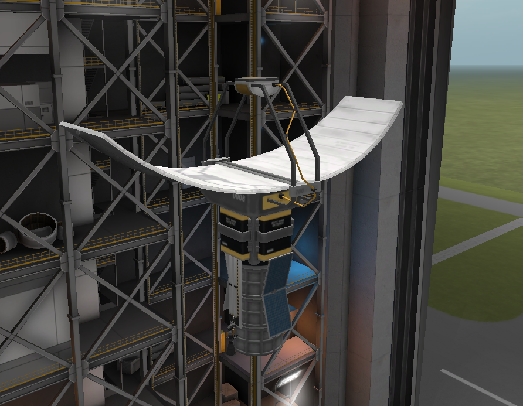
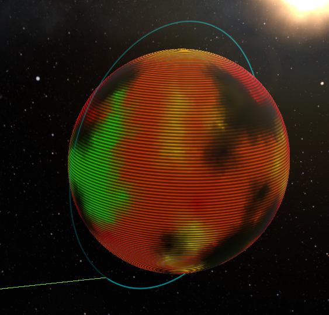
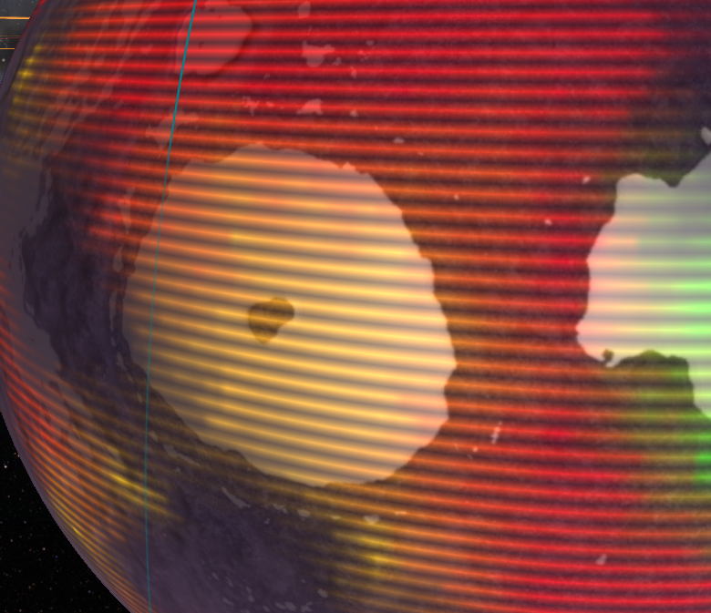
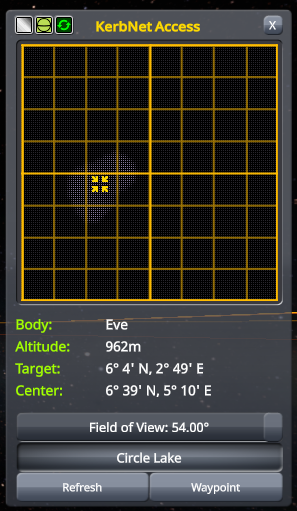
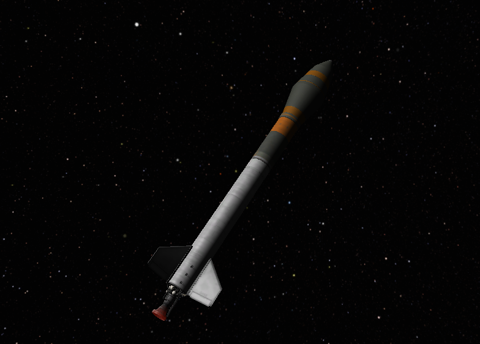
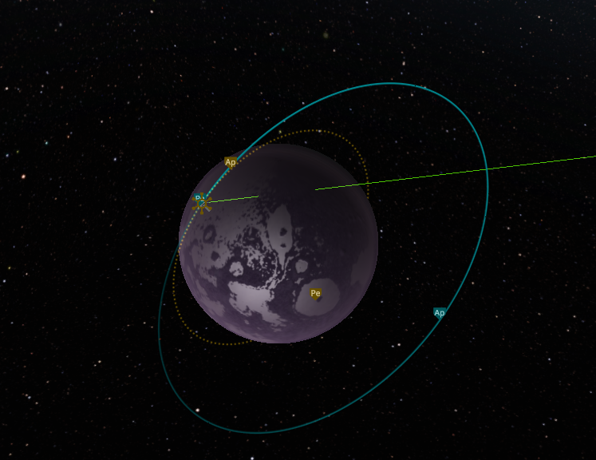
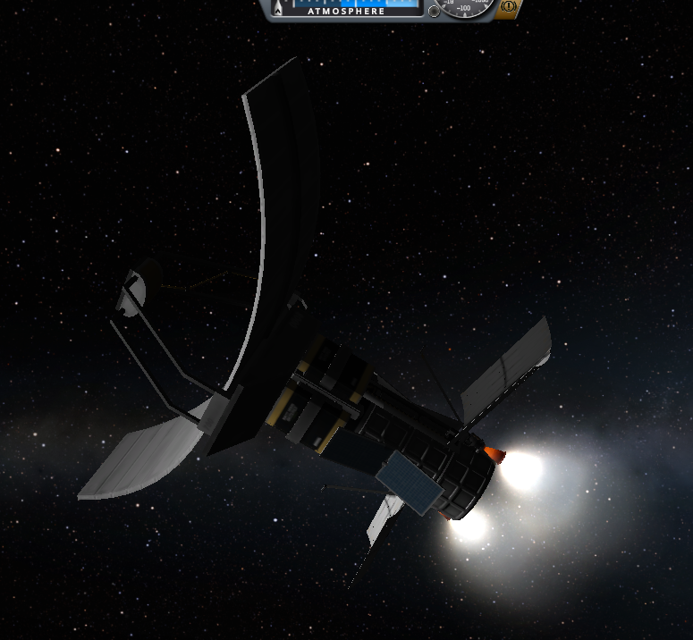

## EVE-O1

## Status: Partial Success
### Requirements
- CommNet connection
- Sane alignment with Eve
### Goals
- ✔ 100km 90° polar orbit over Eve
- ❌ Report atmosphere altitude
- ✔ Scan for ore
- ✔ Find a rough Δv requirement
### Design
- 1.914 km/s Δv
- Thruster: 2x Spider
- Control: Probodobodyne OKTO
- Experiments: M700 Survey Scanner
- Communication: 2x DTS-M1
### Data
- Orbital survey
- No anomalies
    - Low detection rate of OKTO?
    - Rare Eve anomalies?
- Yellow/green islands to be investigated for temperate outpotst 
- Discovered "Great Cold Spot"
    - Cold lake area, large island within (viable outpost location?)
- Discovered "Circle Lake"
    - Warm lake area, large island at center (viable outpost location?)
    - Scans show terrain may be variable - probe exploration highly recommended
### Notes
- Lost probe control during circularization above Eve; most remaining Δv was wasted in a spin
- ~4 km/s Δv required total
### Images

