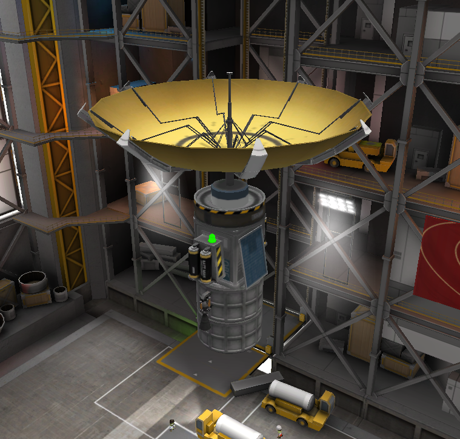
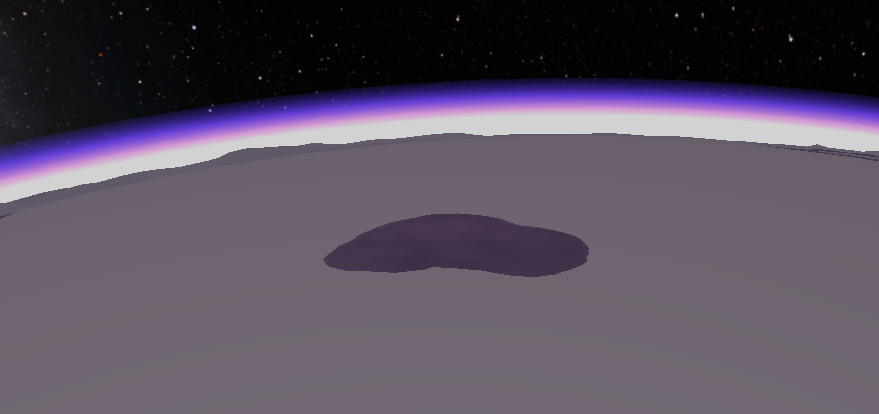
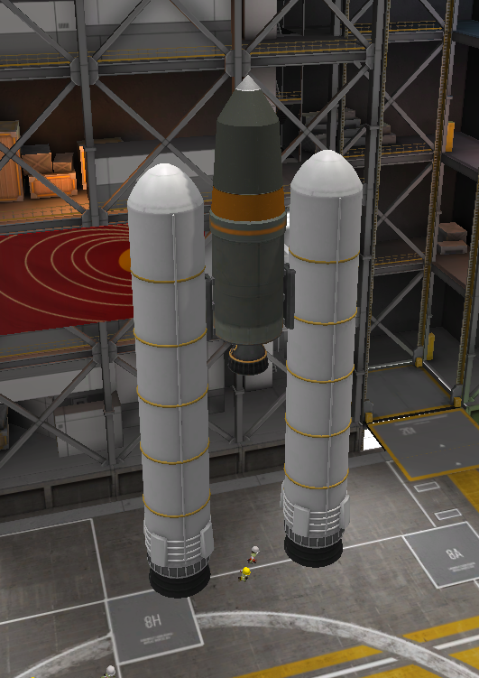

## EVE-O1

## Status: Success
### Requirements
- CommNet connection
- Sane alignment with Eve
### Goals
- ✔ Report atmosphere altitude
### Design
- 2.258 km/s Δv
- Thruster: 2x Spider
- Control: Probodobodyne QBE
- Experiments: N/A
- Communication: Communotron 88-88
### Data
- Atmosphere altitude is 80 km
### Notes
- Hit atmosphere at ~5 km/s
- Burned up in ~8 km
### Images

